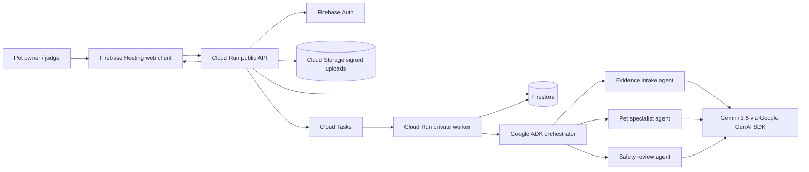

# PETi architecture

PETi is an evidence-first, safety-bounded multi-agent application for responsible pet care. The browser is a thin client; durable state, uploads, orchestration and model execution live behind authenticated Google Cloud services.

## Agent boundaries

- The orchestrator owns the bounded run and delegates to three specialist agents.
- Evidence intake extracts only observable, source-linked facts.
- The pet specialist interprets the requested capability without diagnosing or prescribing.
- Safety review evaluates uncertainty, missing evidence and escalation signals.
- Every run persists its plan, state transitions, provenance and final review status.

## Reliability and safety

Runs are asynchronous, idempotent and bounded by step, model-call, tool-call, media, context, time and cost budgets. Cloud Tasks authenticates worker delivery. The worker is private; the public API never exposes model credentials. Uncertain or concerning cases end in review-required status rather than fabricated certainty.

## Hackathon stack mapping

| Requirement | PETi implementation |
|---|---|
| Gemini 3.5+ | Gemini 3.5 Flash through the Google GenAI SDK |
| Google agent framework | Google ADK `LlmAgent` and delegated sub-agents |
| Google Cloud | Cloud Run, Firestore, Cloud Storage and Cloud Tasks |
| Autonomous workflow | API creates a run, Cloud Tasks dispatches it, worker executes and persists progress |
