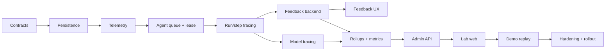

# PETi Veterinary AI Lab

## Plan de construcción exhaustivo y de bajo nivel

| Campo | Valor |
|---|---|
| Documento base | `docs/PETI_VETERINARY_AI_LAB_SPEC.md` |
| Repositorio | PETi |
| Estado | Plan listo para ejecución |
| Versión | 1.0 |
| Fecha | 2026-08-31 |
| Stack existente | FastAPI/Python 3.13, Firestore, Cloud Run, Cloud Tasks, Firebase Auth/Hosting, Google ADK/Gemini, JavaScript ES modules, Playwright |

---

## 1. Resultado final esperado

Al completar este plan, PETi tendrá:

- Feedback contextual y editable al final de cada respuesta agéntica elegible.
- Una identidad inmutable para cada versión de respuesta.
- Trazas durables de runs, steps, handoffs, llamadas a modelos, herramientas, evidencias y seguridad.
- Métricas de utilidad, fundamentación, seguridad, frustración, rendimiento y coste.
- Una consola administrativa protegida llamada **PETi Veterinary AI Lab**.
- Vistas de Command Center, runs, agentes, modelos, evidencias, feedback, safety/evals, coste y salud.
- Datos de demo reproducibles y claramente separados de producción.
- Evaluaciones y releases conectados mediante versiones y gates críticos.
- Privacidad, borrado, exportación, retención, RBAC y auditoría para las nuevas entidades.
- Tests unitarios, integración, seguridad, privacidad, E2E, accesibilidad y visual regression.
- Despliegue gradual mediante flags, shadow telemetry y rollback.

Este documento describe cómo construirlo sobre el código actual. No asume una reescritura del producto ni un nuevo framework frontend.

---

## 2. Decisiones arquitectónicas

### 2.1 Mantener el stack actual

- Backend: FastAPI y dataclasses/Pydantic.
- Persistencia inicial: Firestore.
- Procesamiento: API pública + worker privado de Cloud Run.
- Autenticación: Firebase Auth y roles internos del backend.
- Web: HTML/CSS y ES modules sin bundler.
- Tests web: Playwright.
- Infraestructura: Terraform y scripts PowerShell existentes.

No se añade React, Next.js, BigQuery, Kafka, Redis, una base SQL ni un proveedor SaaS. Podrían ser útiles a escala, pero aumentarían coste y riesgo sin aportar valor inmediato al hackathon.

### 2.2 Backend como única autoridad

- La web solo llama APIs autenticadas.
- La web no escribe directamente en Firestore.
- El cliente nunca decide qué modelo, agente, versión, safety state o deployment se atribuye al feedback.
- El servidor resuelve esas relaciones desde entidades persistidas.
- Las reglas de Firestore continúan fail-closed para clientes.

### 2.3 Eventos append-only y vistas materializadas

- `telemetry_events` conserva eventos sanitizados e idempotentes.
- Entidades de traza conservan el estado consultable de run/step/model/tool.
- `metric_rollups` almacena agregados horarios y diarios para que la consola no escanee toda la colección.
- El detalle se consulta por IDs; los paneles se alimentan de rollups.

### 2.4 Sin chain-of-thought

La instrumentación captura estados, reason codes, entradas/salidas estructuradas permitidas, versiones, claims y evidencias. No captura razonamiento privado, scratchpads ni prompts con datos sensibles.

### 2.5 Separar experiencia real y demo

- Producción real: APIs protegidas y datos de Firestore.
- Demo pública `/?demo=1`: fixtures estáticos versionados bajo `web/demo/lab/`.
- Cada fixture incluye `data_classification: "SYNTHETIC_DEMO"`.
- Toda pantalla demo muestra una banda persistente “Demo data · synthetic replay”.
- Los eventos demo no se envían al backend real.

### 2.6 Rollout primero read-only

La primera consola será de solo lectura. Controles como promover, rollback o kill switch se mostrarán desactivados en demo y no se implementarán hasta que auditoría, permisos y gates estén completos.

### 2.7 Convenciones temporales

- Timestamps de servidor en UTC, ISO 8601 en APIs.
- Buckets de rollup: `YYYY-MM-DDTHH:00:00Z` y `YYYY-MM-DD`.
- La zona del navegador solo afecta a presentación.
- IDs: UUID v4 u opacos; nunca contienen PII.

---

## 3. Problemas existentes que deben resolverse antes

### 3.1 Rutas de agentes inconsistentes

La web usa actualmente:

```text
POST /v1/agent/runs
GET  /v1/agent/runs/{id}
POST /v1/agent/runs/{id}/cancel
```

El router dedicado expone:

```text
POST /v1/dogs/{dog_id}/agent-runs
GET  /v1/agent-runs/{id}
POST /v1/agent-runs/{id}/cancel
```

Además, el middleware de scope bloquea superficies de agente fuera de `LOCAL`. Antes de instrumentar:

1. Elegir como contrato canónico `/v1/dogs/{dog_id}/agent-runs`.
2. Actualizar `web/app.js` para usarlo.
3. Añadir una ruta de creación que encole realmente `/internal/tasks/agent`; hoy la creación solo persiste `QUEUED`.
4. Sustituir la lista literal de rutas bloqueadas por feature flags server-side explícitos.
5. Habilitar el vertical slice en `DEV/STAGING` únicamente tras pasar tests/evals.
6. Mantener un alias deprecado solo si algún cliente publicado lo necesita; en caso contrario, eliminarlo.

Archivos:

- `web/app.js`
- `backend/app/api/agent_runs.py`
- `backend/app/main.py`
- `backend/app/analysis/queue.py` o nuevo `backend/app/agent_runtime/queue.py`
- `backend/app/config/settings.py`
- Tests de scope, worker y agente.

### 3.2 Persistencia de run demasiado agregada

Los steps están embebidos en `agent_runs.steps`. Esto dificulta consultas, timelines, concurrencia y crecimiento. El plan conserva temporalmente el array por compatibilidad, pero crea colecciones normalizadas y deja de usar el array como fuente analítica.

### 3.3 Analytics en memoria

`AnalyticsRecorder.events` se pierde al reiniciar y no puede unir API/worker. Debe convertirse en una fachada sobre un repositorio durable, manteniendo el contrato antiguo mientras se migran call sites.

### 3.4 Admin actual es JSON sin producto

`web/extended-views.js` solo imprime `/v1/internal/ops/metrics`. Se reemplazará gradualmente por módulos propios del Lab y estados de carga/error/restricción.

### 3.5 Roles demasiado gruesos

`UserRole` solo tiene `CUSTOMER`, `INTERNAL_TEST` y `ADMIN`. Para P0, `ADMIN` tendrá acceso completo read-only. Después se añade una capa de permisos de laboratorio sin romper usuarios persistidos.

---

## 4. Estructura objetivo de archivos

### 4.1 Backend nuevo

```text
backend/app/lab/
  __init__.py
  contracts.py
  enums.py
  hashing.py
  redaction.py
  repositories.py
  firestore_repositories.py
  telemetry.py
  tracing.py
  feedback.py
  permissions.py
  queries.py
  rollups.py
  metrics.py
  frustration.py
  reviews.py
  experiments.py
  audit.py
  demo.py

backend/app/api/lab.py
backend/app/api/feedback.py
backend/app/agent_runtime/queue.py
backend/app/agent_runtime/instrumentation.py
backend/app/ai/providers/instrumented.py
```

### 4.2 Contratos versionados

```text
contracts/lab/telemetry-event-v1.schema.json
contracts/lab/response-feedback-v1.schema.json
contracts/lab/run-trace-v1.schema.json
contracts/lab/model-call-trace-v1.schema.json
contracts/lab/metric-rollup-v1.schema.json
contracts/lab/human-review-v1.schema.json
contracts/lab/experiment-v1.schema.json
```

### 4.3 Frontend nuevo

```text
web/lab/
  lab.js
  lab-api.js
  lab-state.js
  lab-router.js
  lab-format.js
  lab-charts.js
  lab-components.js
  views/
    command-center.js
    live-runs.js
    run-inspector.js
    agent-laboratory.js
    model-intelligence.js
    evidence-lab.js
    feedback-lab.js
    safety-evals.js
    performance-cost.js
    system-health.js
    audit-governance.js
  demo/
    demo-adapter.js

web/lab.css
web/demo/lab/manifest.json
web/demo/lab/overview.json
web/demo/lab/runs.json
web/demo/lab/run-luna.json
web/demo/lab/run-max.json
web/demo/lab/agents.json
web/demo/lab/models.json
web/demo/lab/feedback.json
web/demo/lab/evaluations.json
```

### 4.4 Tests nuevos

```text
backend/tests/test_lab_contracts.py
backend/tests/test_lab_telemetry.py
backend/tests/test_lab_tracing.py
backend/tests/test_lab_feedback.py
backend/tests/test_lab_permissions.py
backend/tests/test_lab_queries.py
backend/tests/test_lab_rollups.py
backend/tests/test_lab_metrics.py
backend/tests/test_lab_frustration.py
backend/tests/test_lab_privacy.py
backend/tests/test_lab_audit.py
backend/tests/test_lab_demo_isolation.py
backend/tests/test_instrumented_provider.py
backend/tests/test_agent_queue.py
backend/tests/test_agent_route_release.py

tests/e2e/lab-demo.spec.js
tests/e2e/lab-admin.spec.js
tests/e2e/feedback-response.spec.js
tests/e2e/lab-accessibility.spec.js
tests/e2e/lab-visual-regression.spec.js
```

### 4.5 Scripts e infraestructura

```text
scripts/migrate_lab_v1.py
scripts/backfill_lab_traces.py
scripts/seed_lab_demo.py
scripts/verify_lab_data.py
scripts/build_lab_demo_fixtures.py
scripts/check_lab_contracts.py
scripts/check_lab_privacy.py

infra/monitoring/lab-runbook.md
```

### 4.6 Matriz exacta de archivos existentes a modificar

| Archivo existente | Cambio de bajo nivel | Motivo |
|---|---|---|
| `backend/app/main.py` | Construir repositorios/servicios Lab; envolver provider; montar routers; inyectar queue; enriquecer middleware; retirar bloqueo literal de rutas por flag | Composition root único |
| `backend/app/main_worker.py` | Emitir trace context; validar owner contra run; adquirir lease; completar/fallar traza; añadir tareas de rollup si se alojan aquí | Ejecución privada observable e idempotente |
| `backend/app/config/settings.py` | Añadir settings Lab y `deployment_revision`; validación por entorno | Terraform ya envía deployment revision, pero hoy se ignora por `extra="ignore"` |
| `backend/app/api/dependencies.py` | Añadir dependencies de permisos Lab y helper de audit de acceso sensible | Evitar checks repetidos `str(role) == "ADMIN"` |
| `backend/app/api/agent_runs.py` | Ruta canónica, enqueue, response IDs, provenance enriquecida, feedback eligibility | Vertical slice real |
| `backend/app/api/v1.py` | Retirar/alias de rutas duplicadas; delegar admin antiguo; no acumular endpoints Lab en el archivo monolítico | Evitar contratos divergentes |
| `backend/app/agents/contracts.py` | Campos de correlación/versiones/timestamps; persistencia backward-compatible; hooks de tracing | Identidad durable de ejecución |
| `backend/app/agents/technical_contracts.py` | Reutilizar ExecutionPlan/AgentStep y añadir solo campos versionados necesarios | Evitar un segundo modelo de plan |
| `backend/app/agents/roster.py` | Añadir metadata de display, version, release state y contract IDs; conservar capabilities | Agent Laboratory dinámico |
| `backend/app/agent_runtime/execution.py` | Plan real, step scopes, trace calls, respuesta inmutable y clasificación final | Fuente principal del timeline |
| `backend/app/agent_runtime/state_machine.py` | Alinear transiciones y reason codes con traces si existe duplicidad con `AgentOrchestrator` | Una sola semántica de estados |
| `backend/app/agent_runtime/adk_graph.py` | Exponer metadata estable de nodos/versiones; no exponer instrucciones internas | Topología real |
| `backend/app/analysis/queue.py` | Extraer/reutilizar primitives de Cloud Tasks o servir de patrón para AgentTaskQueue | Enqueue consistente |
| `backend/app/analysis/service.py` | Crear InteractionResponse y invocation context; emitir outcome/safety/evidence metrics | Cubrir análisis además de agent runs |
| `backend/app/analysis/domain.py` | Añadir response/interaction/deployment IDs con defaults | Compatibilidad y correlación |
| `backend/app/ai/providers/base.py` | Añadir `AIInvocationContext` opcional y observer de intentos | Trazabilidad sin globals |
| `backend/app/ai/providers/fake.py` | Soportar nuevo argumento y usage/error fixtures | Tests deterministas |
| `backend/app/ai/providers/gemini.py` | Observer por intento y metadata real permitida | Retries/model usage exactos |
| `backend/app/analytics.py` | Convertir en fachada durable o deprecarla tras dual-write; preservar eventos antiguos | Evitar pérdida por reinicio |
| `backend/app/operations/platform.py` | Persistir cost ledger; añadir flags Lab; enlazar support cases con run/response | Operación y seguridad |
| `backend/app/logging.py` | Ampliar allowlist segura y redacción de nuevos campos prohibidos | Privacidad |
| `backend/app/privacy/service.py` | Inventario/export/borrado/residual verification de entidades Lab | Derechos del usuario |
| `backend/app/privacy/lifecycle.py` | Dependencias y retenciones Lab | Borrado correcto |
| `backend/app/domain/users.py` | Mantener roles persistidos; no añadir permisos granulares directamente al enum P0 | Evitar migración destructiva |
| `firestore.indexes.json` | Índices compuestos Lab | Queries sin scans |
| `firestore.rules` | Tests/deny explícito para colecciones Lab si no lo cubre catch-all | Sin acceso directo cliente |
| `firebase.json` | Headers de cache para fixtures/módulos; CSP si está gestionada aquí | Hosting correcto |
| `web/index.html` | Añadir `lab.css`; mantener scripts como módulos y cache-busting versionado | Cargar consola |
| `web/app.js` | Ruta de agentes, response rendering, feedback mount, gating de nav admin, cleanup de timers | Integración usuario + Lab |
| `web/extended-views.js` | Sustituir JSON `<pre>` por root Lab; conservar soporte genérico separado | Admin real |
| `web/styles.css` | Solo tokens compartidos; estilos Lab aislados en `lab.css` | Reducir regresiones |
| `web/mobile-fixes.css` | Ajustes globales solo si Lab descubre una regla compartida | Evitar parches específicos dispersos |
| `web/i18n.js` | Añadir todas las claves Lab/feedback ES-EN y fallback observable | Localización completa |
| `playwright.config.js` | Proyectos/fixtures Lab si es necesario; clock/snapshot settings | Replay determinista |
| `scripts/check.ps1` | Nuevos validators/tests/gates | CI local completo |
| `scripts/check_metric_cardinality.py` | Catálogo de dimensiones Lab | Control de coste/privacidad |
| `scripts/check_logging_contract.py` | Canaries de comentario/prompt/secret | Prevenir fugas |
| `infra/cloudrun/deploy.ps1` | Variables/flags Lab y despliegue fail-closed | Rollout operativo |
| `infra/cloudrun/env.dev.example` | Documentar settings sin secretos | Configuración reproducible |
| `infra/terraform/modules/peti-platform/main.tf` | IAM, TTL, schedulers, env vars | Infra declarativa |
| `infra/terraform/modules/peti-platform/monitoring.tf` | Dashboard/alerts del pipeline Lab | Observar observabilidad |
| `release/REQUIREMENTS_TRACEABILITY_MATRIX.md` | Añadir requisitos Lab y evidencia | Trazabilidad de release |
| `release/EVIDENCE_MANIFEST.json` | Incorporar artifacts de tests/demo tras implementación | Evidencia verificable |

### 4.7 Archivos que no deben convertirse en fuentes de verdad del Lab

- `release/evidence/**`: evidencia de release, nunca runtime data.
- `test-results/**`: outputs efímeros, nunca fixtures de producto.
- `backend/peti_backend.egg-info/**`: artifacts generados, no editar para implementar.
- `.firebase/hosting.*.cache`: cache generado, no editar manualmente.
- `eval/**/run_*.json`: artifacts de evaluación; se ingieren mediante manifest/hash, no se consultan directamente desde una ruta web.

---

## 5. Contratos de dominio

### 5.1 Enums

Crear `backend/app/lab/enums.py` con `StrEnum`:

```python
class EnvironmentClass(StrEnum):
    LOCAL = "LOCAL"
    DEV = "DEV"
    STAGING = "STAGING"
    PRODUCTION = "PRODUCTION"

class DataClassification(StrEnum):
    REAL = "REAL"
    SYNTHETIC_DEMO = "SYNTHETIC_DEMO"
    TEST = "TEST"

class FeedbackValue(StrEnum):
    HELPED = "HELPED"
    NOT_QUITE = "NOT_QUITE"

class ResponseSourceType(StrEnum):
    AGENT_RUN = "AGENT_RUN"
    ANALYSIS = "ANALYSIS"
    SPECIALIST_ANALYSIS = "SPECIALIST_ANALYSIS"
    GROUNDED_ASSISTANT = "GROUNDED_ASSISTANT"
    WEEKLY_REPORT = "WEEKLY_REPORT"

class TraceStatus(StrEnum):
    STARTED = "STARTED"
    SUCCEEDED = "SUCCEEDED"
    FAILED = "FAILED"
    CANCELLED = "CANCELLED"
    POLICY_BLOCKED = "POLICY_BLOCKED"

class ReviewSeverity(StrEnum):
    LOW = "LOW"
    MEDIUM = "MEDIUM"
    HIGH = "HIGH"
    CRITICAL = "CRITICAL"
```

Añadir enums cerrados para reason codes de feedback, seguridad, error, handoff y outcome. No guardar strings arbitrarios en dimensiones analíticas.

### 5.2 `InteractionResponse`

Crear en `contracts.py` una dataclass inmutable a nivel lógico:

| Campo | Tipo | Regla |
|---|---|---|
| `id` | str | UUID/opaco |
| `owner_user_id` | str | Solo plano operacional |
| `owner_hash` | str | Derivado server-side para analítica |
| `interaction_id` | str | Obligatorio |
| `run_id` | str opcional | Si procede de agente |
| `source_type` | enum | Obligatorio |
| `source_id` | str | ID de entidad origen |
| `response_version` | int | Empieza en 1 |
| `supersedes_response_id` | str opcional | Regeneraciones |
| `outcome` | str | Enum normalizado |
| `safety_state` | str | Congelado al publicar |
| `content_ref` | str opcional | Referencia protegida, no texto analítico |
| `agent_version_set` | dict | IDs/versiones participantes |
| `model_version_set` | list | IDs/configuración usada |
| `deployment_id` | str | Obligatorio fuera de local |
| `eligible_for_feedback` | bool | Calculado en servidor |
| `published_at` | datetime | Timestamp servidor |
| `deleted_at` | datetime opcional | Soft-delete mientras se propaga borrado |

Persistir en `interaction_responses/{response_id}`. Una respuesta publicada no se modifica; una regeneración crea otra.

### 5.3 `ResponseFeedback`

Campos:

- `id`
- `owner_user_id`
- `owner_hash`
- `response_id`
- `run_id`
- `interaction_id`
- `value`
- `reasons: list[FeedbackReason]`, máximo 5, sin duplicados.
- `comment_ref`, nunca comentario raw en esta entidad.
- `safety_report`
- `outcome_value` opcional.
- `source`, `locale`, `client_version`.
- Versiones congeladas copiadas desde `InteractionResponse`.
- `revision`, `created_at`, `updated_at`, `removed_at`.
- `environment`, `data_classification`.

ID determinista recomendado:

```text
feedback_id = SHA256(owner_user_id + ":" + response_id)[:40]
```

Esto hace idempotente la unicidad sin consulta previa. El hash no se expone como prueba de identidad.

### 5.4 Comentario de feedback

`feedback_comments/{feedback_id}`:

- `feedback_id`
- `owner_user_id`
- `ciphertext` o texto protegido por Firestore/IAM en P0.
- `redaction_status`
- `contains_potential_pii`
- `created_at`, `updated_at`, `expires_at`.

P0 puede usar cifrado en reposo gestionado por GCP y control IAM. Antes de uso sostenido, añadir envelope encryption/KMS si el threat model lo exige.

### 5.5 Trazas

Crear entidades separadas:

- `AgentRunTrace`
- `AgentStepTrace`
- `ModelCallTrace`
- `ToolCallTrace`
- `SafetyDecisionTrace`
- `EvidenceUsageTrace`

Cada entidad debe incluir `schema_version`, `environment`, `data_classification`, `correlation_id`, `deployment_id`, timestamps y `expires_at`.

### 5.6 Evento

`TelemetryEvent`:

- Envelope fijo.
- `properties` validado contra un mapa por `event_name`.
- Sin contenido libre.
- Máximo serializado 32 KB.
- Rechazar claves no allowlisted.
- `event_id` generado en servidor o determinista para transitions idempotentes.

### 5.7 Rollup

`MetricRollup`:

```text
id = {granularity}:{bucket}:{metric}:{dimension_hash}
```

Campos:

- granularidad `HOUR`/`DAY`.
- bucket UTC.
- metric name/version.
- dimensiones normalizadas.
- `numerator`, `denominator`, `count`, `sum`, `min`, `max`.
- histogram buckets para latencia/coste.
- `source_watermark` y `computed_at`.
- `is_preliminary`.

No guardar arrays de usuarios ni IDs de runs en rollups.

---

## 6. Persistencia y repositorios

### 6.1 Protocolos

En `backend/app/lab/repositories.py`, definir protocolos independientes:

- `TelemetryEventRepository.append(event) -> bool`
- `TraceRepository.start_*`, `complete_*`, `get_run_trace`, `list_*`
- `ResponseRepository.put_immutable`, `get_owned`, `get_by_source`
- `FeedbackRepository.upsert`, `get_owned`, `remove`, `list_admin`
- `RollupRepository.upsert`, `query`
- `ReviewRepository.create`, `claim`, `resolve`, `list`
- `AuditRepository.append`, `list`

Crear adaptadores in-memory para tests/local y Firestore para entornos durables.

### 6.2 Escritura idempotente Firestore

- `telemetry_events`: `document(event_id).create()`; si existe, devolver `False`.
- Transiciones de trace: transacción Firestore; comprobar estado previo.
- Feedback: transacción que incrementa `revision`, conserva `created_at` y reemplaza el valor activo.
- Respuestas: `create()`; prohibir overwrite salvo backfill explícito.
- Rollups: transacción o escritura determinista completa desde ventana, no incrementos no reproducibles.

### 6.3 Consultas

Evitar `store.all()` en APIs administrativas. Implementar consultas Firestore paginadas y filtradas.

Índices a añadir en `firestore.indexes.json`:

- `agent_run_traces`: environment + started_at desc.
- `agent_run_traces`: environment + status + started_at desc.
- `agent_run_traces`: environment + safety_state + started_at desc.
- `agent_step_traces`: run_id + started_at asc.
- `model_call_traces`: run_id + started_at asc.
- `model_call_traces`: environment + model_id + started_at desc.
- `interaction_responses`: owner_user_id + published_at desc.
- `response_feedback`: owner_user_id + updated_at desc.
- `response_feedback`: environment + value + updated_at desc.
- `human_reviews`: status + severity + created_at asc.
- `metric_rollups`: granularity + bucket + metric_name.
- `admin_audit_events`: occurred_at desc.

Verificar cada índice con emulator tests y desplegar índices antes del backend que los consulte.

### 6.4 TTL

Añadir `expires_at` a eventos/trazas/comentarios. Configurar Firestore TTL mediante Terraform para colecciones de alto volumen. No aplicar TTL a auditoría o registro de versiones hasta aprobar su política.

### 6.5 Evolución sin downtime

1. Desplegar colecciones/repositorios sin cambiar lecturas.
2. Activar dual-write de trazas detrás de `lab_telemetry_enabled`.
3. Verificar completitud con `scripts/verify_lab_data.py`.
4. Backfill de runs recientes.
5. Activar APIs read-only.
6. Activar frontend admin.
7. Retirar dependencia analítica de `agent_runs.steps`; conservar compatibilidad de lectura.

---

## 7. Servicio de telemetría

### 7.1 `TelemetryService`

Crear `backend/app/lab/telemetry.py`:

```python
class TelemetryService:
    def emit(self, event_name, *, context, properties, event_id=None): ...
```

Responsabilidades:

- Validar nombre y properties.
- Inyectar environment, deployment, schema version y timestamps.
- Pseudonimizar owner mediante HMAC con secreto rotatorio server-side.
- Rechazar PII y campos prohibidos.
- Persistir idempotentemente.
- Registrar fallo técnico sanitizado sin fallar la operación principal, excepto cuando el evento sea una auditoría obligatoria.
- Exponer contadores de dropped/invalid telemetry.

### 7.2 Contexto de traza

Crear `TraceContext`:

```python
@dataclass(frozen=True)
class TraceContext:
    correlation_id: str
    interaction_id: str
    run_id: str | None
    step_id: str | None
    owner_user_id: str | None
    pet_id: str | None
    agent_id: str | None
    deployment_id: str
    environment: str
    data_classification: str
    experiment_id: str | None = None
    variant_id: str | None = None
```

Pasarlo explícitamente entre service calls. No depender de globals para lógica; se puede usar `contextvars` solo para enriquecer logs, no como fuente de autorización.

### 7.3 Middleware HTTP

Modificar el middleware `correlation` en `backend/app/main.py`:

- Validar `X-Correlation-ID`: máximo 128, caracteres seguros; si no, generar UUID.
- Crear `request.state.interaction_id` para peticiones que inician interacción.
- Añadir `X-Interaction-ID` a respuesta cuando exista.
- Emitir `api_request_completed` solo con route template, método, status, duración y role class; nunca URL completa/query.
- No emitir health checks a telemetría de producto.

### 7.4 Allowlist y cardinalidad

Actualizar:

- `backend/app/logging.py`
- `scripts/check_logging_contract.py`
- `scripts/check_metric_cardinality.py`

Permitir IDs opacos de trace, model ID normalizado, agent ID, status y duration. Prohibir `goal`, `prompt`, `response`, `comment`, `email`, `pet_name`, URLs y media content.

---

## 8. Instrumentación de la ejecución agéntica

### 8.1 Normalizar el plan

Sustituir la lista embebida en `AgentExecutionService._execute` por un `ExecutionPlan` real de `technical_contracts.py`:

- `plan`
- `evidence-intake`
- `peti-check`
- `safety-review`
- `care-report`

Cada nodo tendrá `executor_id`, dependencias y output schema. Persistir `plan_id` y `recipe_id`.

### 8.2 Extender `AgentRun`

Añadir campos compatibles con defaults:

- `interaction_id`
- `correlation_id`
- `plan_id`
- `recipe_id`
- `deployment_id`
- `response_id`
- `outcome`
- `safety_state`
- `started_at`, `completed_at`.

No eliminar campos existentes en la primera migración.

### 8.3 Instrumentar transiciones

Modificar `AgentOrchestrator._set_state` o envolverlo con `AgentTraceService`:

- Emitir evento determinista por `run_id + previous + target + transition_sequence`.
- Persistir timestamps por estado.
- Calcular queue wait y run duration server-side.
- No emitir duplicados por redelivery.

### 8.4 Instrumentar steps

Antes de un step:

- Crear `agent_step_traces/{run_id}:{step_id}` en `STARTED`.
- Guardar agent ID/version, schema, dependency IDs, budget snapshot.
- Emitir `agent_step_started`.

Después:

- Guardar status, duration, outcome, evidence/claim counts, safety state.
- Guardar output summary allowlisted, no payload completo.
- Emitir `agent_step_completed` o `agent_step_failed`.

### 8.5 Handoffs

Cuando cambia executor:

- Crear evento `agent_handoff` con `from_agent`, `to_agent`, `reason_code` y `evidence_count`.
- El reason code se deriva del plan; no se inventa a partir de texto del modelo.

### 8.6 Publicación de respuesta

En `complete()`:

1. Validar grounding y safety.
2. Crear `InteractionResponse` con snapshot de versiones.
3. Persistir `response_id` en run.
4. Marcar `eligible_for_feedback` según outcome.
5. Emitir `response_published`.
6. Completar run trace.
7. Devolver `response_id` y `feedback_eligible` en API pública.

El orden debe evitar un run `COMPLETED` sin respuesta identificable. Usar batch/transaction cuando API y repositorio compartan Firestore.

### 8.7 Cloud Tasks para agentes

Crear `AgentTaskQueue` inspirado en `analysis/queue.py`:

- Payload: `run_id`, `owner_user_id`, `media_asset_ids`, `context_ref` opcional.
- Nada de raw media o prompt.
- Task name determinista `agent-{run_id}`.
- OIDC hacia `/internal/tasks/agent`.
- Crear run y enqueue con reconciliación/idempotencia.
- Si enqueue falla, marcar run `WAITING` con reason `QUEUE_SUBMISSION_FAILED`, no dejarlo eternamente `QUEUED`.
- Worker redelivery observa estado terminal y no repite modelo.

### 8.8 Concurrencia durable

El `RLock` solo protege una instancia. Añadir un claim transaccional Firestore:

- `execution_lease_owner`
- `execution_lease_expires_at`
- `execution_attempt`

El worker adquiere lease antes de llamar al proveedor. Si existe lease vigente, devuelve 200 idempotente. Si expira, otro worker puede recuperarlo. Completar/fallar libera lease lógicamente.

---

## 9. Instrumentación del proveedor de IA

### 9.1 Contexto de invocación

Extender el protocolo de `AIProvider.analyze` con parámetro keyword opcional:

```python
def analyze(self, media, prompt, context=None, *, invocation=None): ...
```

`AIInvocationContext` contiene:

- trace context.
- prompt ID/version/hash.
- schema/guardrail/safety/media prep versions.
- model binding.
- attempt budget.

Actualizar `FakeAIProvider`, `GeminiProvider`, transports y todos los call sites. Mantener default `None` para migración gradual.

### 9.2 Decorador `InstrumentedAIProvider`

Crear `backend/app/ai/providers/instrumented.py`:

- Envuelve el provider configurado en `main.py`.
- Genera `model_call_id`.
- Persiste `STARTED` antes de invocar.
- Cronometra con `time.perf_counter()`.
- En éxito guarda provider/model reales devueltos, usage, request ID, schema status y finish reason disponible.
- En `ProviderError` guarda error class/code/retriable y status.
- En excepción inesperada usa `UNEXPECTED_PROVIDER_ERROR`, nunca `str(exc)` sin sanitizar.
- Re-lanza la excepción original.

### 9.3 Intentos y retries

Si `GeminiProvider` reintenta internamente, añadir callback/observer por intento:

```python
observer.on_attempt_started(...)
observer.on_attempt_failed(...)
observer.on_attempt_completed(...)
```

Cada intento tiene sub-ID; el model call agregado conserva total latency y attempt count. No contar un retry como una interacción adicional.

### 9.4 Coste

- Mantener `CostAttributionService` como ledger operativo.
- Persistir el record durable; hoy es in-memory.
- Crear `PricingRegistry` versionado.
- Cuando usage no está disponible, `usage_status="UNKNOWN"`; nunca tokens/coste cero.
- `estimated_cost_microunits` y `actual_cost_microunits` separados.
- Asociar coste a call, step, run, agente, modelo y deployment.

### 9.5 Instrumentar otras superficies

Orden:

1. `AgentExecutionService`.
2. `AnalysisService`.
3. Worker de especialistas.
4. Narración de weekly report.
5. Grounded assistant.

Todas deben usar `InteractionResponse`, aunque no todas formen parte de P0.

---

## 10. Feedback: backend

### 10.1 Modelos HTTP

En `backend/app/api/feedback.py` usar Pydantic:

```python
class FeedbackUpsertRequest(BaseModel):
    value: FeedbackValue
    reasons: list[FeedbackReason] = []
    comment: str | None = Field(None, max_length=1000)
    locale: str | None = Field(None, max_length=16)

class OutcomeRequest(BaseModel):
    value: OutcomeValue
```

Validadores:

- Máximo 5 reasons.
- Sin duplicados.
- Reasons compatibles con valor positivo/negativo.
- Trim de comentario; vacío se convierte en `None`.
- Rechazar control chars salvo salto de línea/tab.
- `safety_report` usa endpoint independiente.

### 10.2 Endpoints

Implementar:

```text
PUT    /v1/agent-runs/{run_id}/responses/{response_id}/feedback
GET    /v1/agent-runs/{run_id}/responses/{response_id}/feedback
DELETE /v1/agent-runs/{run_id}/responses/{response_id}/feedback
POST   /v1/agent-runs/{run_id}/responses/{response_id}/safety-report
POST   /v1/agent-runs/{run_id}/outcomes
```

Más adelante, rutas genéricas por source type si las necesita análisis/assistant.

### 10.3 Secuencia de upsert

1. Autenticar principal.
2. Validar `Idempotency-Key` o aceptar PUT naturalmente idempotente.
3. Cargar response.
4. Verificar owner, run, no borrada y elegible.
5. Resolver metadata/versiones desde response.
6. Guardar comentario restringido si existe.
7. Upsert feedback en transacción.
8. Emitir `feedback_submitted` o `feedback_updated` después de commit.
9. Invalidar/recalcular rollup de bucket afectado.
10. Devolver representación pública sin owner hash interno.

### 10.4 Safety report

- No tratarlo como simple reason.
- Crear `SupportCase(category="SAFETY")` enlazado a `response_id` y `run_id`.
- Crear `HumanReview` con severity inicial calculada por reglas.
- Emitir evento de seguridad/auditoría.
- Respuesta pública evita prometer intervención clínica inmediata.
- Aplicar rate limiting sin bloquear un primer reporte legítimo.

### 10.5 Eliminación

- `DELETE` marca `removed_at` y elimina/expira comentario.
- Emite `feedback_removed`.
- Rollups excluyen revisiones removidas.
- El audit técnico conserva que hubo una mutación, no el valor retirado ni comentario.

### 10.6 Antiabuso

- Un feedback por owner/response.
- Máximo razonable de ediciones por hora.
- Sanitizar comentario al renderizar; nunca `innerHTML` con contenido libre.
- No ejecutar clasificación LLM síncrona sobre comentarios.

---

## 11. Feedback: frontend de usuario

### 11.1 Componente

Crear funciones en `web/lab/lab-components.js` reutilizables desde la app principal:

- `renderResponseFeedback(response, existingFeedback)`.
- `bindResponseFeedback(container, adapter)`.
- `renderFeedbackReasons(value)`.
- `renderFeedbackConfirmation()`.

No insertar el componente en un resultado sin `response_id` y `feedback_eligible=true`.

### 11.2 Integración inicial

Modificar:

- `web/app.js` `analysisResult()`.
- `web/app.js` `agents()` para mostrar final response.
- `web/extended-views.js` para grounded assistant cuando el backend devuelva response ID.

El componente debe vivir dentro de la tarjeta de respuesta, después de seguridad/procedencia.

### 11.3 Estado

Extender `state`:

```javascript
feedbackByResponse: new Map(),
feedbackPending: new Set(),
feedbackErrors: new Map()
```

Como `state` puede serializarse/renderizarse, si `Map` complica el patrón actual usar objetos sin prototipo.

### 11.4 Flujo UX

- Clic positivo/negativo hace optimistic selection, pero no muestra éxito hasta respuesta 2xx.
- Deshabilitar solo el grupo durante request.
- Si falla, restaurar estado anterior y mostrar error inline.
- Reasons opcionales aparecen después del primer submit.
- Guardar reasons/comentario con botón “Enviar detalle”.
- “Cambiar valoración” reabre el componente.
- “Retirar valoración” requiere confirmación ligera.
- Safety link siempre visible tras feedback negativo.

### 11.5 Accesibilidad

- `fieldset` + `legend` para pregunta.
- Botones con `aria-pressed`.
- Estado async en `aria-live="polite"`.
- Error asociado por `aria-describedby`.
- Foco no se mueve salvo al abrir panel de motivos.
- Touch target mínimo 44×44.
- No depender solo de color.

### 11.6 Demo

El adapter demo guarda feedback en `sessionStorage` con namespace `peti.lab.demo.feedback.v1`. La UI muestra el cambio en métricas locales sin network call y lo etiqueta como simulado.

---

## 12. Métricas y rollups

### 12.1 Catálogo versionado

Crear `backend/app/lab/metrics.py` con `MetricDefinition`:

- `name`
- `version`
- `description`
- `unit`
- `numerator_event`
- `denominator_event`
- dimensiones permitidas.
- minimum sample size.
- higher/lower is better.
- safety guardrail flag.

Métricas P0:

- `runs_total`
- `runs_completed_rate`
- `runs_failed_rate`
- `run_latency_ms`
- `helpfulness_rate`
- `feedback_coverage_rate`
- `negative_feedback_rate`
- `first_pass_resolution_rate`
- `rephrase_rate`
- `context_loop_rate`
- `grounded_claim_rate`
- `safe_completion_rate`
- `safety_routed_rate`
- `schema_first_pass_rate`
- `model_call_latency_ms`
- `input_tokens`, `output_tokens`, `cached_tokens`
- `estimated_cost_microunits`
- `cost_per_helpful_response`
- `friction_index`
- `rufs_rate`

### 12.2 Cálculo de RUFS

No calcularlo en el cliente. Implementar función pura:

```python
def classify_rufs(run, response, feedback, implicit_signals) -> RufsClassification:
```

Estados por dimensión: `PASS`, `FAIL`, `UNKNOWN`, `NOT_ELIGIBLE`.

- Utilidad sin feedback explícito puede ser `UNKNOWN`, no PASS automático.
- Grounded PASS si claims relevantes tienen evidencia o el outcome declara insuficiencia correctamente.
- Safety PASS solo si no hay gate crítico y safety state permite display/abstención segura.
- RUFS PASS requiere tres PASS.
- El dashboard muestra cobertura de clasificación para no ocultar UNKNOWN.

### 12.3 Índice de Fricción

Implementar en `frustration.py`:

- Ventana por `interaction_id`.
- Dedupe de señales.
- Pesos versionados en `FrustrationPolicy`.
- Output con score y contributions.
- Unit tests por combinación.

### 12.4 Job de rollup

Crear `RollupService.compute_window(start, end, granularity)`:

1. Leer eventos por occurred_at + event ID.
2. Resolver watermark.
3. Calcular métricas puras.
4. Reescribir documentos deterministas de esa ventana.
5. Registrar `rollup_completed` con counts.
6. Permitir rerun por eventos tardíos.

P0:

- Rollup horario cada 10 minutos sobre hora actual y anterior.
- Rollup diario cada hora sobre hoy y ayer.
- La consola puede mostrar últimos eventos con query directa limitada; KPIs vienen de rollups.

### 12.5 Intervalos

Implementar Wilson 95 % server-side para proporciones. API devuelve:

```json
{
  "value": 0.82,
  "numerator": 82,
  "denominator": 100,
  "ci95": {"low": 0.733, "high": 0.881},
  "preliminary": false
}
```

### 12.6 Cardinalidad

Dimensiones permitidas P0:

- environment/data classification.
- hour/day.
- agent type/version.
- model ID.
- prompt version.
- analysis/goal type.
- modality.
- species.
- locale.
- outcome/safety state.
- deployment/experiment variant.

No usar user, pet, run, response, comment, raw error o request ID como dimensión de rollup.

---

## 13. APIs administrativas

### 13.1 Router y permisos

Crear `backend/app/api/lab.py` con prefijo `/v1/internal/lab`.

Crear dependencies:

- `require_lab_viewer`
- `require_lab_reviewer`
- `require_lab_operator`
- `require_lab_admin`

P0: solo `ADMIN` satisface todas; `INTERNAL_TEST` puede acceder a demo/staging si flag explícito. P1: resolver permisos desde colección `lab_role_bindings` o custom claims validados.

### 13.2 Endpoints P0 y response shapes

#### `GET /overview`

Query:

- `from`, `to` ISO UTC, máximo 90 días.
- filtros allowlisted.

Devuelve:

- metric cards con intervalos.
- run state counts.
- agent topology aggregate.
- alerts.
- active deployment/model set.
- learning opportunities.
- `data_freshness_at`.

#### `GET /runs`

- Cursor y `limit <= 100`.
- filtros por status, agent, model, safety, feedback, min duration.
- resumen sin goal/raw content por defecto.

#### `GET /runs/{run_id}`

- Run, plan, steps, handoffs, model/tool calls, evidence metadata, safety decisions, response metadata, feedback summary.
- `include_content=false` por defecto.
- `include_content=true` exige permiso y audit event.

#### `GET /agents`

- Roster completo con release state.
- Métricas por agente.
- `activity_status`: active/no activity/not released.

#### `GET /models`

- IDs dinámicos obtenidos de trazas.
- Version/config metrics, quality-cost points y deployment bindings.

#### `GET /evidence/metrics`

- Counts por modalidad, bytes/duración/páginas agregados, quality/outcomes.

#### `GET /feedback`

- Agregados y lista paginada de items.
- Comentario oculto salvo `include_comment=true` + permiso + auditoría.

#### `GET /safety/reviews`

- Cola paginada, severidad/status/category/age.

#### `GET /evaluations`

- Lee manifests/resultados normalizados persistidos, no archivos arbitrarios por path del cliente.

#### `GET /performance`

- Latencia, tokens, coste y queue age.

#### `GET /health`

- Dependencias y freshness; no secretos/config raw.

### 13.3 Validación de filtros

- Pydantic query models.
- Rango temporal obligatorio/default 24h.
- Máximo 90 días para detalle; rollups permiten más.
- Enum cerrado para sort.
- Escapar cursor firmado/opaque.
- Error 400 estable, no traceback.

### 13.4 Cache

- Cache HTTP privada corta: `Cache-Control: private, max-age=15` para overview.
- ETag por watermark/filtros.
- `no-store` para contenido/reviews/audit.
- No introducir Redis P0.

### 13.5 Actualización en vivo

P0: polling adaptativo:

- 5 s en Live Runs visible.
- 15 s en Command Center.
- Pausar con pestaña oculta.
- Backoff hasta 60 s en errores.

P2: SSE si el valor justifica mantener conexiones Cloud Run. No bloquear P0 por SSE.

---

## 14. Consola web: shell y arquitectura

### 14.1 Entrada

Mantener route `ADMIN`, pero renderizar el Lab:

- En `extendedView("ADMIN")`, devolver solo `<div id="peti-lab-root">` y estado inicial.
- Importar dinámicamente `./lab/lab.js` al entrar en ADMIN.
- `lab.js` monta/desmonta listeners y timers.
- Al salir de ADMIN, abortar requests y polling.

### 14.2 Estado del Lab

`lab-state.js`:

```javascript
{
  route: "COMMAND_CENTER",
  filters: {...},
  loading: {},
  errors: {},
  data: {},
  selectedRunId: null,
  pollingPaused: false,
  demo: boolean,
  abortControllers: new Map()
}
```

API funcional:

- `getState()`
- `setState(patch)`
- `subscribe(listener)`
- `reset()`

### 14.3 Adapter de datos

`lab-api.js` define interfaz común:

- `getOverview(filters)`
- `listRuns(filters, cursor)`
- `getRun(id)`
- `listAgents(filters)`
- etc.

Implementaciones:

- `RealLabAdapter`: usa `window.PETI_API`.
- `DemoLabAdapter`: fetch JSON estático y simula latencia determinista de 150 ms.

Las views no conocen si el origen es demo o real.

### 14.4 Router interno

Usar hash secundario compatible con la app actual:

```text
#ADMIN/COMMAND_CENTER
#ADMIN/RUNS
#ADMIN/RUNS/{id}
#ADMIN/AGENTS
#ADMIN/MODELS
...
```

Validar segmentos e IDs. Back/forward debe funcionar. No introducir un router externo.

### 14.5 Componentes base

Crear funciones puras que devuelvan DOM nodes o HTML escapado:

- `LabShell`
- `LabNav`
- `DemoBanner`
- `FilterBar`
- `MetricCard`
- `MetricWithCI`
- `Sparkline`
- `StatusBadge`
- `DataFreshness`
- `EmptyState`
- `ErrorState`
- `RestrictedState`
- `LoadingSkeleton`
- `AgentTopology`
- `RunTimeline`
- `BudgetMeter`
- `DataTable`
- `Pagination`
- `DetailDrawer`

Toda interpolación usa `textContent` o `escapeHtml`. Comentarios nunca pasan por template HTML sin escape.

### 14.6 Charts sin dependencia

Para P0 usar SVG accesible generado por `lab-charts.js`:

- Sparkline.
- Line chart.
- Horizontal bars.
- Heatmap.
- Scatter quality-cost.
- Agent topology.

Cada chart incluye:

- Título/descripcion accesible.
- Tabla o resumen textual equivalente.
- Escalas calculadas con protección de dominio vacío.
- `viewBox` responsive.
- Sin animación si reduced motion.

Si posteriormente se adopta una librería, evaluar bundle, licencia, accesibilidad y CSP.

### 14.7 Navegación, autorización y visibilidad

- El enlace de administración solo se muestra a un usuario autenticado cuya respuesta `/v1/me` o `/v1/internal/lab/access` indique `can_view_lab=true`.
- Ocultar el enlace no es una barrera de seguridad; todos los endpoints validan permisos.
- En `?demo=1`, mostrar un acceso separado “Veterinary AI Lab demo”, no fingir rol ADMIN.
- Si un usuario pega `#ADMIN` sin permiso, renderizar `RestrictedState`; no redirigir silenciosamente ni filtrar si existe el Lab.
- Al expirar Firebase token, abortar polling, limpiar datos administrativos en memoria y volver al estado restringido.
- Al cambiar de cuenta, ejecutar `labState.reset()` antes de cualquier nueva consulta.
- No conservar responses administrativas en `localStorage`, IndexedDB o service-worker cache.

### 14.8 Internacionalización

- Añadir claves semánticas a `web/i18n.js`; no traducir comparando bloques de texto completos nuevos.
- Cobertura inicial completa en español e inglés.
- Mantener IDs técnicos —run, modelo, versión, reason code— sin traducir; traducir su etiqueta/explicación.
- Formatear fechas, duración, moneda, porcentajes y números con `Intl` y locale activo.
- Plurales mediante helpers, no concatenación `n + " runs"`.
- La API devuelve enums estables en inglés; la web los mapea a copy localizado.
- Si falta una clave, mostrar fallback español/inglés y emitir warning de desarrollo; nunca string vacío.
- Añadir test que recorra todas las views Lab en `es` y `en` y falle ante una key ausente.

---

## 15. Construcción de cada vista

### 15.1 Command Center

Orden de implementación:

1. Shell + demo banner.
2. Filter bar global.
3. RUFS card con cobertura.
4. Utilidad/fundamentación/seguridad separadas.
5. Run state strip.
6. Agent topology.
7. Patient journey funnel.
8. Friction/helpfulness.
9. Active alerts.
10. Cost per useful response.
11. Recent changes.
12. Learning opportunities.

Cada card muestra loading, empty, error, preliminary y stale.

### 15.2 Live Runs

- Tabla paginada.
- Auto-refresh conserva scroll y selección.
- Nuevos runs aparecen con highlight no intrusivo.
- Columnas mobile se reducen a run/status/duration/safety.
- Filtros rápidos: running, waiting, failed, safety, negative feedback, slow.
- Click abre `Run Inspector` por route, no modal obligatorio.

### 15.3 Run Inspector

Construir tabs:

1. Overview.
2. Timeline.
3. Evidence & claims.
4. Models & tools.
5. Safety.
6. Feedback.
7. Versions.

Orden visual del timeline por server timestamp + sequence. Si hay clock conflict, mostrar warning y usar sequence.

### 15.4 Agent Laboratory

- Roster se obtiene de backend, no literal frontend.
- Card con release state y “no activity” honesto.
- Topología agregada.
- Matriz agent × outcome.
- Comparación current/previous version.
- Detalle de contract, model bindings, tools y budgets.

### 15.5 Model Intelligence

- Tabla model/config.
- Scatter quality-cost.
- Latency/tokens/cost.
- Heatmap por modality/goal complexity.
- Champion/challenger solo si existe experiment binding.
- Labels “No concluyente” cuando intervalos se solapan o n insuficiente.

### 15.6 Evidence Lab

- Cards de fotos/vídeos/audios/documentos.
- Quality/rejection/insufficient rates.
- Claim coverage.
- Media preparation latency.
- Contenido/thumbnails desactivado P0 salvo permiso específico.

### 15.7 User Experience & Feedback

- Helpfulness + coverage.
- Reasons bars.
- Friction breakdown.
- Funnel de interacción.
- Tabla high-impact misses.
- Comentarios ocultos por defecto.
- Botón “Ver comentario” auditable y no disponible demo real.

### 15.8 Safety & Evals

- Gates críticos como primera fila.
- Review queue.
- Eval runs y release states.
- Regresiones por deployment.
- P0 read-only.

### 15.9 Performance & Cost

- E2E latency y breakdown.
- Token/cost trend.
- Cost per helpful/RUFS.
- Budget meter.
- Unknown usage claramente separado de cero.

### 15.10 Health y Audit

- Health muestra disponibilidad/freshness/queue.
- Audit muestra eventos paginados y reason codes.
- Nunca mostrar env vars, secret IDs sensibles o tokens.

---

## 16. Demo/replay para el hackathon

### 16.1 Fixture manifest

`manifest.json`:

```json
{
  "schema_version": "1.0.0",
  "data_classification": "SYNTHETIC_DEMO",
  "generated_at": "2026-08-31T00:00:00Z",
  "scenario": "LUNA_MAX_MULTI_AGENT_LAB",
  "routes": {}
}
```

### 16.2 Escenarios

**Luna:** cinco fotos, evidencia suficiente, respuesta grounded, safety pass, feedback positivo.

**Max:** cinco fotos, limitaciones/señales que requieren revisión o nueva evidencia, feedback “no sé qué hacer ahora”, challenger shadow que mejora claridad sin alterar decisión segura.

### 16.3 Replay de run

- Eventos con timestamps relativos `t_ms`.
- Botones `Play`, `Pause`, `Restart`, `1×/2×`.
- Los pulsos de topología se derivan de eventos.
- Al terminar, la respuesta y feedback aparecen.
- No usar timers dispersos; un `ReplayController` central calcula estado desde elapsed time.
- Playwright puede fijar clock y reproducir determinísticamente.

### 16.4 Generación de fixtures

`scripts/build_lab_demo_fixtures.py`:

- Lee un fixture fuente validado.
- Elimina owner IDs, request IDs y contenido no permitido.
- Fuerza classification demo.
- Valida JSON schemas.
- Produce archivos ordenados/deterministas.
- Falla si detecta email, token, URL firmada o ID de proyecto real.

---

## 17. Evaluaciones, reviews y experimentos

### 17.1 Ingesta de evals existentes

Crear script que lea outputs aprobados de `eval/` y persista solo metadata/resultados normalizados:

- eval ID/suite/split.
- runner version.
- model/prompt/schema/safety versions.
- case counts.
- métricas.
- seis critical gates.
- artifact path relativo + hash.
- created_at/deployment candidate.

No permitir path suministrado desde API.

### 17.2 Human review

`HumanReview` incluye:

- source/run/response IDs.
- reason/severity/status.
- assignment y lease.
- rubric version.
- scores por dimensión.
- error category.
- final decision.
- reviewer hash y timestamps.
- second review si procede.

P0 solo listar casos y mostrar detalle. P1 añade claim/resolve.

### 17.3 Experimentos

P1/P2:

- `Experiment` y `Variant` versionados.
- Assignment determinista HMAC sobre owner/session + experiment ID.
- Exclusiones por safety/capability.
- Shadow no cambia respuesta visible.
- Canary congela variante por interacción/usuario según diseño.
- Métrica primaria, guardrails, min sample y ventana definidos antes de start.
- No editar experimento RUNNING; crear nueva revisión.

### 17.4 Release decision

Una decisión de promoción persiste:

- candidato y baseline.
- eval IDs.
- métricas y intervalos.
- gates.
- approver, reason, timestamp.
- deployment target.

No automatizar promoción P0. Rollback debe apuntar a una versión conocida.

---

## 18. Privacidad y lifecycle

### 18.1 Inventario

Modificar `backend/app/privacy/service.py` para incluir:

- interaction responses.
- feedback y comentarios.
- run/step/model/tool traces owner-scoped.
- reviews con referencias owner-scoped.
- experiment assignments.

Los rollups agregados no se exportan como datos personales, pero su diseño debe impedir reidentificación.

### 18.2 Exportación

El export del usuario incluye:

- Feedback activo y historial de revisiones si política lo requiere.
- Response IDs y source associations.
- Outcome reports.
- No incluye auditoría interna, otros usuarios, costes internos, prompts o reviews internas.

### 18.3 Borrado

Orden:

1. Marcar response/feedback deleted.
2. Eliminar comentario.
3. Borrar entidades owner-scoped y traces con owner.
4. Eliminar experiment assignments.
5. Recalcular rollups afectados sin usuario.
6. Ejecutar residual verifier.
7. Registrar auditoría sin PII.

Actualizar tests de residual deletion y dependencias.

### 18.4 Retención

Añadir categorías a `RETENTION_CATEGORIES`:

- `LAB_TELEMETRY_RAW`
- `LAB_TRACE`
- `LAB_FEEDBACK_COMMENT`
- `LAB_REVIEW`
- `LAB_AUDIT`

Defaults configurables; validar que local/test no creen recursos reales.

---

## 19. Seguridad, permisos y auditoría

### 19.1 Permisos

Crear enum `LabPermission`:

- `LAB_VIEW_AGGREGATES`
- `LAB_VIEW_TRACES`
- `LAB_VIEW_USER_CONTENT`
- `LAB_VIEW_FEEDBACK_COMMENTS`
- `LAB_REVIEW_CASES`
- `LAB_MANAGE_EXPERIMENTS`
- `LAB_MANAGE_RELEASES`
- `LAB_MANAGE_KILL_SWITCHES`
- `LAB_VIEW_AUDIT`

Map P0:

- ADMIN: todos los read permissions; mutaciones según endpoint existente.
- INTERNAL_TEST: aggregates/traces solo no-production o synthetic.
- CUSTOMER: ninguno.

### 19.2 Auditoría

Eventos obligatorios:

- acceso a contenido de usuario.
- acceso a comentario.
- export admin.
- review claimed/resolved.
- experiment created/started/stopped.
- release promoted/rolled back.
- kill switch cambiado.
- permisos cambiados.

El audit event debe persistir o la mutación crítica falla cerrada.

### 19.3 Threat cases a probar

- IDOR de run/response/feedback.
- Customer accede `/internal/lab`.
- Demo query intenta acceder a producción.
- Cursor manipulado.
- Filtro inyecta field/path.
- Comentario XSS.
- CSV formula injection.
- Evento intenta incluir token/base64/signed URL.
- Replay de PUT feedback.
- Cloud Task redelivery duplica model call.
- Worker intenta usar owner del payload para otro run.
- Admin sin content permission usa `include_content=true`.

---

## 20. Configuración y feature flags

### 20.1 Settings

Añadir a `Settings`:

```text
lab_enabled = false
lab_telemetry_enabled = false
lab_feedback_enabled = false
lab_admin_enabled = false
lab_rollups_enabled = false
lab_demo_enabled = true
lab_comment_retention_days = 90
lab_trace_retention_days = 180
lab_event_retention_days = 90
lab_rollup_min_sample = 30
lab_hmac_secret_id = null
deployment_revision = "local"
```

Validación:

- Admin/feedback en non-local requieren Firestore.
- Telemetry real requiere deployment revision no vacía.
- Producción no permite `lab_demo_seed_backend=true`.
- Retenciones positivas y acotadas.

### 20.2 Feature flags durables

Añadir a `OperationsService.flags`:

- `lab_telemetry_enabled`
- `lab_feedback_enabled`
- `lab_admin_enabled`
- `lab_live_polling_enabled`
- `lab_human_review_enabled`
- `lab_experiments_enabled`

Defaults fail-closed salvo demo estática.

### 20.3 Matriz por entorno

| Capacidad | Local | Dev | Staging | Production |
|---|---:|---:|---:|---:|
| Demo fixtures | Sí | Sí | Sí | Sí, explícitamente demo |
| Durable telemetry | Emulator | Sí | Sí | Shadow primero |
| Feedback real | Emulator | Sí | Sí | Canary |
| Admin real | Emulator | ADMIN | ADMIN | ADMIN allowlist |
| Experimentos mutables | No | Opcional | Controlado | No P0 |

---

## 21. Infraestructura

### 21.1 IAM

API service account:

- Leer/escribir colecciones Lab necesarias.
- Leer secretos HMAC/KMS si se usa.
- No acceder al contenido de media fuera del flujo existente.

Worker service account:

- Escribir traces/model calls/events.
- Leer run/media según permisos existentes.
- No acceder a admin queries.

Scheduler service account:

- Invocar solo endpoints internos de rollup/retention con audience específica.

### 21.2 Scheduler

Terraform:

- `lab-rollup`: cada 10 min, endpoint `/v1/internal/tasks/lab-rollup`.
- `lab-retention`: diario, endpoint `/v1/internal/tasks/lab-retention`.
- OIDC y audiences dedicadas o maintenance identity existente si el scope es exactamente compatible.

No exponer estas rutas en el worker público; autenticar service account y audience.

### 21.3 Monitoring

Añadir métricas/alertas para:

- telemetry write failures.
- invalid/dropped events.
- rollup lag.
- feedback API 5xx.
- admin API p95/5xx.
- agent queue age.
- duplicate execution prevented.
- provider latency/error/cost anomaly.

Actualizar `infra/monitoring/monitoring.yaml`, Terraform dashboard y runbook.

### 21.4 Firestore rules

Confirmar que las colecciones nuevas quedan inaccesibles al cliente. Si rules actuales tienen catch-all deny, añadir tests que lo demuestren. No añadir reglas de escritura cliente para feedback: todo pasa por API.

### 21.5 CORS/CSP

- Métodos PUT ya deben añadirse a `allow_methods`; ahora falta `PUT`.
- Headers permitidos: correlation/interaction si el cliente los usa.
- Mantener allowed origins exactos.
- Actualizar CSP de Hosting si módulos/charts lo requieren; no usar inline scripts nuevos.

---

## 22. Migración y backfill

### 22.1 Migración v1

`scripts/migrate_lab_v1.py` debe:

- Requerir environment explícito.
- Rechazar production sin `--confirm-production`.
- Ser dry-run por defecto.
- Crear/configurar documentos de registro/versiones, no colecciones vacías.
- Verificar índices/TTL esperados.
- Guardar migration record con commit/deployment.
- Ser idempotente.

### 22.2 Backfill de runs

`scripts/backfill_lab_traces.py`:

- Seleccionar por rango y límite.
- Leer `agent_runs`.
- Crear run/step traces con `trace_quality="BACKFILLED_PARTIAL"`.
- Derivar provider/model solo cuando está explícito en step.
- Marcar campos desconocidos como `UNKNOWN`; no inventar timings o tokens.
- No emitir eventos de usuario nuevos ni alterar métricas históricas por defecto.
- Reportar counts/skips/errors en JSON.

### 22.3 Validación

`verify_lab_data.py` calcula:

- runs terminales con response ID.
- steps con trace.
- model calls con provider/model/status.
- feedback huérfano.
- cross-environment contamination.
- unknown usage coverage.
- duplicate event IDs.
- rollup vs raw sample del mismo periodo.

El script sale != 0 si viola invariantes críticas.

---

## 23. Plan de pruebas

### 23.1 Unitarias

Probar:

- Validación de cada contrato/enum.
- HMAC/pseudonimización estable y rotación.
- Redacción y allowlist.
- Dedupe/idempotencia.
- State transitions.
- RUFS con PASS/FAIL/UNKNOWN.
- Friction contributions.
- Wilson interval.
- Cost unknown vs zero.
- Permissions matrix.
- Filter validation/cursors.

### 23.2 Repositorios Firestore emulator

- Append create-only.
- Transacciones concurrentes de feedback.
- Lease concurrente de run.
- Paginación estable con documentos iguales en timestamp usando ID tie-breaker.
- Índices usados.
- TTL field presente.
- Queries owner/admin separadas.

### 23.3 Integración API

- Auth missing/invalid/customer/admin.
- Feedback owner/non-owner.
- Edit/remove.
- Safety report crea case/review.
- Admin endpoints y filtros.
- `include_content` auditado.
- Errors con correlation ID.
- CORS PUT.
- Rate limits.

### 23.4 Worker y proveedor

- Cloud Task válida/inválida.
- Redelivery no duplica call.
- Lease recovery.
- Provider success/retry/final fail/timeout.
- Usage missing.
- Schema repair.
- Trace completado también en error.

### 23.5 Privacidad

- Export incluye feedback permitido.
- Borrado elimina comments/traces/assignments.
- Residual verifier.
- Rollup no contiene user IDs.
- Logs no contienen goal/comment/prompt/token/media.

### 23.6 E2E web

Feedback:

- Positivo, negativo, reasons, comment, edit, remove, error retry.
- Keyboard y screen reader semantics.
- Demo sessionStorage y no network.

Lab:

- Admin access/restricted.
- Todas las routes y back/forward.
- Filtros y URL.
- Pagination.
- Polling pause/resume.
- Empty/error/stale/preliminary/unknown states.
- Replay Luna/Max.
- No content leak.

### 23.7 Visual regression

Snapshots desktop/tablet/mobile de:

- Command Center normal/demo/empty/alert.
- Live Runs.
- Run Inspector Luna y Max.
- Agent Lab.
- Model Intelligence.
- Feedback Lab.
- Safety/Evals.
- Reduced motion.
- Spanish/English.

Enmascarar timestamps dinámicos; fijar clock y fixtures.

### 23.8 Performance

Objetivos P0 iniciales:

- Overview API p95 < 500 ms con rollups.
- Runs list p95 < 750 ms para 100 rows.
- Admin initial render < 2,5 s en red rápida con fixture.
- Polling no solapa requests.
- Evento/trace añade < 20 ms p95 de overhead de aplicación, excluyendo Firestore; escrituras no críticas pueden bufferizarse de forma segura.
- Feedback PUT p95 < 800 ms.

### 23.9 Gate completo

Añadir a `scripts/check.ps1`:

- contract validation.
- lab privacy/cardinality checks.
- tests Lab.
- demo fixture schema.
- Playwright Lab en job separado si duración lo exige.
- Terraform fmt/validate.

---

## 24. Secuencia de implementación por pull requests

### PR 1 — Contratos y foundation

Dependencias: ninguna.

Cambios:

- Enums, dataclasses/Pydantic, JSON schemas.
- In-memory repositories.
- Redaction, hashing y permissions skeleton.
- Tests puros.

Salida: contratos congelados v1; ningún comportamiento productivo cambia.

### PR 2 — Firestore repositories e índices

Dependencias: PR 1.

- Adapters Firestore.
- Índices y emulator tests.
- TTL fields/config plan.
- Migration/verification skeleton.

Salida: persistencia disponible detrás de flags.

### PR 3 — Telemetry service y middleware

Dependencias: PR 2.

- Event service.
- Trace context.
- HTTP metadata.
- Logging/cardinality/privacy checks.

Salida: eventos básicos en local emulator; flag off por defecto.

### PR 4 — Agent route/queue/concurrency repair

Dependencias: PR 2/3.

- Ruta canónica web/backend.
- Agent Cloud Tasks queue.
- Durable lease.
- Scope flag.
- Worker redelivery tests.

Salida: ejecución real de agente funciona en DEV con FakeAI/approved provider configuration.

### PR 5 — Run/step/evidence/safety traces

Dependencias: PR 4.

- ExecutionPlan real.
- Run/step/handoff traces.
- Response publication.
- Provenance endpoint enriquecido.

Salida: Run Inspector tiene fuente durable completa salvo model internals.

### PR 6 — Provider/model/cost traces

Dependencias: PR 3/5.

- Invocation context.
- Instrumented provider.
- Retry observer.
- Durable cost attribution.

Salida: cada model call queda atribuida a run/step/agent/version.

### PR 7 — Feedback backend y privacidad

Dependencias: PR 5.

- APIs, repositorios, comments, safety report.
- Export/deletion/retention.
- Permission/rate limit tests.

Salida: feedback real listo detrás de flag.

### PR 8 — Feedback web

Dependencias: PR 7.

- Componente, integración agent/analysis, demo adapter.
- A11y/E2E/visual tests.

Salida: valoración completa visible en canary.

### PR 9 — Rollups y métricas

Dependencias: PR 3/5/6/7.

- Catalog, RUFS, friction, Wilson.
- Jobs y scheduler endpoint.
- Reconciliation/raw-vs-rollup tests.

Salida: KPIs rápidos y reproducibles.

### PR 10 — Admin API read-only

Dependencias: PR 9.

- Queries, filtros, pagination, permissions, audit access.
- Endpoints overview/runs/agents/models/feedback/health.

Salida: contrato administrativo completo P0.

### PR 11 — Lab shell y Command Center

Dependencias: PR 10; demo fixtures pueden desarrollarse en paralelo.

- Modules, adapters, state/router, CSS, base components.
- Command Center y demo banner.

Salida: primera experiencia wow funcional.

### PR 12 — Run Inspector, Agents y Models

Dependencias: PR 11.

- Live Runs.
- Run Inspector.
- Agent Laboratory.
- Model Intelligence.

Salida: historia multiagente explicable end-to-end.

### PR 13 — Evidence, Feedback, Safety, Cost, Health

Dependencias: PR 12.

- Resto de vistas P0/P1 read-only.
- Eval ingestion.
- Audit view.

Salida: consola completa.

### PR 14 — Demo replay y vídeo

Puede empezar tras PR 11 y finalizar tras PR 13.

- Luna/Max fixtures.
- Replay controller.
- Playwright deterministic path.
- Capturas/video script actualizado.

Salida: demo reproducible y sin dependencia de tráfico live.

### PR 15 — Infra, rollout y hardening final

Dependencias: anteriores.

- Terraform IAM/TTL/scheduler/alerts.
- Backfill/verify.
- Canary flags.
- Runbooks/rollback/release evidence.

Salida: staging validado y producción canary preparada.

---

## 25. Orden de despliegue

### 25.1 Local/emulator

1. Ejecutar unit tests.
2. Levantar Firebase emulators.
3. Ejecutar migration dry-run y apply local.
4. Ejecutar vertical slice con FakeAI.
5. Ejecutar Playwright feedback/Lab.
6. Verificar export/delete.

### 25.2 DEV

1. Desplegar índices/infra sin activar flags.
2. Desplegar backend compatible.
3. Activar telemetry para INTERNAL_TEST 100 %.
4. Ejecutar runs reales controlados.
5. Verificar trazas, coste, redacción y rollups.
6. Activar admin para allowlist.
7. Activar feedback para testers.
8. Desplegar web.

### 25.3 Staging

1. Backfill opcional de datos de prueba.
2. Shadow telemetry 100 %.
3. Comparar operation outputs con telemetry off/on.
4. Carga y concurrencia.
5. Safety/eval gates.
6. Ensayo de rollback.
7. Go/no-go documentado.

### 25.4 Producción

1. Admin read-only para allowlist.
2. Telemetry al 5 % de runs, después 25/50/100 % si no hay impacto.
3. Feedback al 5 % de respuestas elegibles, después 25/100 %.
4. Rollups y alertas activados antes de ampliar.
5. No activar experiment mutation P0.
6. Monitor reforzado 24 h tras cada incremento.

### 25.5 Rollback

- Flags off: feedback/admin/telemetry por separado.
- Web anterior redeployable desde release artifact.
- Backend nuevo debe leer entidades antiguas aunque flags estén off.
- Nunca borrar colecciones en rollback.
- Detener scheduler si rollup causa carga.
- Conservar audit y traces ya escritos según política.

---

## 26. Observabilidad de la propia observabilidad

El Lab también puede fallar. Añadir:

- `telemetry_events_attempted/written/dropped/invalid`.
- `trace_completeness_rate`.
- `rollup_lag_seconds`.
- `orphan_trace_count`.
- `feedback_write_error_rate`.
- `admin_query_latency/error_rate`.
- `unknown_usage_rate`.
- `demo_fixture_validation_status`.

Estas métricas técnicas se envían a Cloud Monitoring/logging, no al mismo pipeline como única fuente para evitar dependencia circular.

---

## 27. Riesgos y mitigaciones

| Riesgo | Mitigación |
|---|---|
| Coste Firestore por eventos | Eventos mínimos, rollups, TTL, sampling solo para eventos de bajo valor; nunca samplear safety/audit |
| Console lenta por scans | Queries indexadas, cursor pagination, rollups y límites |
| PII en telemetría | Schemas cerrados, redaction, repos separados y tests con canaries sensibles |
| Doble model call por Cloud Tasks | Lease durable + task name + terminal-state idempotency |
| Feedback sesgado | Mostrar coverage, n, CI y dimensiones; no optimizar solo thumbs |
| Efecto wow basado en datos falsos | Label demo persistente y replay determinista |
| Cambios rompen contratos existentes | Defaults/backward compatibility, dual-write, flags |
| Roles insuficientes | ADMIN-only P0; permissions layer P1 |
| Eventos fuera de orden | sequence + timestamps + recompute windows |
| Modelo cambia de nombre/revisión | Model registry dinámico; no hard-code frontend |
| Unknown token/cost | Estado UNKNOWN separado de cero |
| Dashboard revela contenido | Aggregate default, explicit include + permission + audit |
| Rollup incorrecto | Recompute determinista y raw-vs-rollup verifier |

---

## 28. Checklist de Definition of Done global

### Datos

- [ ] Cada respuesta terminal elegible tiene `response_id` inmutable.
- [ ] Cada run tiene correlation/interaction/deployment IDs.
- [ ] Cada step tiene trace y executor/version.
- [ ] Cada model call tiene provider/model/status/latency/version set.
- [ ] Tokens y coste son valor real/estimado/UNKNOWN, nunca ambiguos.
- [ ] Feedback no puede quedar huérfano.
- [ ] Demo/test/prod están aislados.

### Producto

- [ ] Feedback funciona en agent/analysis P0.
- [ ] Lab tiene todas las vistas P0 y estados edge.
- [ ] Run Inspector explica Luna y Max end-to-end.
- [ ] Métricas muestran n, periodo, CI y preliminary.
- [ ] Agentes no ejecutados no parecen activos.
- [ ] Demo replay funciona sin backend.

### Seguridad y privacidad

- [ ] Ningún endpoint expone chain-of-thought.
- [ ] IDOR/RBAC tests pasan.
- [ ] Logs/telemetry no contienen payloads sensibles.
- [ ] Export/delete cubren nuevas entidades.
- [ ] Acceso sensible y mutaciones están auditados.
- [ ] Critical gates bloquean promoción.

### Operación

- [ ] Índices, TTL, IAM y schedulers desplegados.
- [ ] Alertas y runbooks disponibles.
- [ ] Rollback ensayado.
- [ ] Trace completeness y rollup freshness monitorizados.
- [ ] Presupuesto/coste revisado.

### Calidad

- [ ] Ruff, mypy y pytest pasan.
- [ ] Contract/privacy/cardinality checks pasan.
- [ ] Emulator suite pasa.
- [ ] Playwright funcional/a11y/visual pasa.
- [ ] Eval gates críticos pasan.
- [ ] Staging smoke y canary validation pasan.

---

## 29. Camino crítico recomendado



No empezar por los gráficos. El camino crítico es identidad de respuesta → trazabilidad durable → feedback correlacionado → métricas reproducibles → APIs → visualización. Construir la consola antes de estabilizar ese recorrido produciría un dashboard atractivo pero poco fiable.

---

## 30. Primer incremento vertical entregable

La primera entrega que demuestra valor real debe incluir exactamente:

1. Corregir creación/ejecución real de agent run.
2. Añadir `interaction_id`, `correlation_id`, `deployment_id` y `response_id`.
3. Persistir run, cinco steps, handoffs y una model call trace.
4. Mostrar respuesta final con feedback Sí/No del todo.
5. Guardar feedback owner-scoped e idempotente.
6. Calcular helpfulness, coverage, groundedness, safety y RUFS para esa cohorte.
7. Exponer `/internal/lab/overview` y `/internal/lab/runs/{id}`.
8. Renderizar Command Center y Run Inspector.
9. Reproducir Luna y Max en demo, etiquetados.
10. Pasar tests de privacidad, permisos, redelivery y visual regression.

Este slice valida todo el diseño con el menor número de piezas. Después se amplían agentes, modelos, modalidades, evaluaciones, costes y experimentos sin cambiar los contratos fundamentales.
